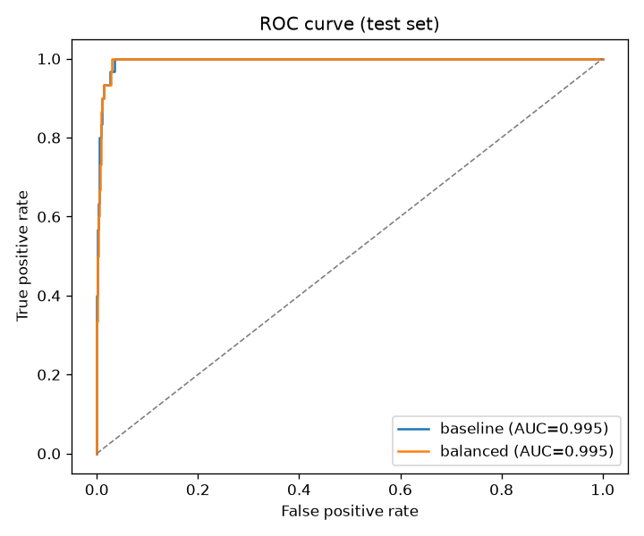
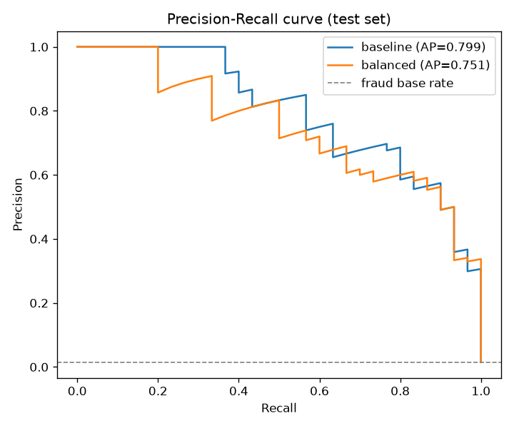
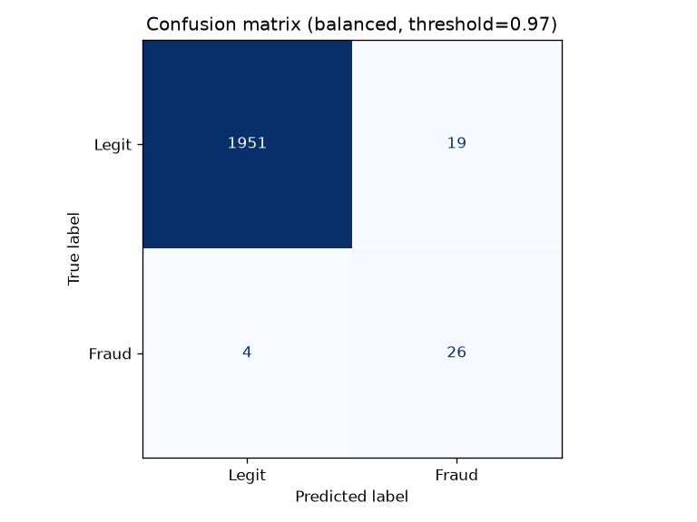

# זיהוי הונאות אשראי – רגרסיה לוגיסטית

מודל רגרסיה לוגיסטית לזיהוי עסקאות הונאה ב-10,000 עסקאות כרטיסי אשראי (`credit_card_fraud_10k.csv`).
הדאטה לא מאוזן: רק **151 הונאות (1.5%)**, ולכן נבדקים ROC AUC, PR AUC, Recall, Precision ו-F1 ולא Accuracy.

פרויקט משלים: דאשבורד ניתוח ויזואלי – [fraud-analytics-dashboard](https://github.com/doryamin12/fraud-analytics-dashboard).

## הרצה
```bash
pip install -r requirements.txt
python logistic_model.py
```
הסקריפט מדפיס את המדדים ושומר ל-`outputs/`: `metrics.json`, `roc_curve.png`, `pr_curve.png`, `confusion_matrix.png`.

## דאשבורד אינטראקטיבי
`dashboard.html` הוא קובץ HTML עצמאי שעובד בלי אינטרנט. פותחים אותו בדפדפן. בדאשבורד יש:
- **בחירת מודל** (רגיל או מאוזן) ו**מחוון לסף ההחלטה**.
- **כרטיסי מדדים:** ROC AUC, PR AUC, Recall, Precision ו-F1, שמתעדכנים לפי הסף.
- **עקומות:** ROC ו-Precision–Recall, וגם גרף של המדדים כפונקציה של הסף.
- **מטריצת בלבול, מקדמי המודל וטבלת השוואה** בין המודלים.

כדי לבנות אותו מחדש מריצים `python build_dashboard.py`. הסקריפט מאמן את המודלים ומטמיע את התחזיות בתבנית `dashboard_template.html`.

## תהליך
1. **פיצ'רים:** סכום, שעה, ציון אמון מכשיר, velocity ב-24 שעות, גיל (מנורמלים); עסקה בחו"ל, אי-התאמת מיקום,
   `is_night` (שעות 0–5, פיצ'ר חדש כי הקשר בין שעה להונאה לא לינארי); קטגוריית סוחר (One-Hot).
2. **חלוקה:** 80% אימון / 20% מבחן, מרובדת. באימון יש 8,000 עסקאות ו-121 הונאות (1.51%), ובמבחן 2,000 עסקאות ו-30 הונאות (1.50%).
3. **שלושה מודלים:** רגיל; `class_weight="balanced"`; balanced עם סף שנבחר לפי F1 על תחזיות out-of-fold של סט האימון
   בלבד (בלי דליפה ל-test).
4. **אימות:** 5-fold CV מרובד.

## תוצאות (test set)

| מודל | סף | ROC AUC | PR AUC | Recall | Precision | F1 |
|---|---|---|---|---|---|---|
| רגיל | 0.50 | 0.995 | 0.799 | 0.567 | 0.810 | 0.667 |
| מאוזן | 0.50 | 0.995 | 0.751 | **1.000** | 0.294 | 0.455 |
| **מאוזן + סף מכויל** | 0.97 | 0.995 | 0.751 | 0.867 | 0.578 | **0.693** |

5-fold CV (מאוזן, סף 0.5): ROC AUC 0.994 ± 0.002, Recall 0.980, Precision 0.311, F1 0.470.

המודל המכויל תופס 26 מתוך 30 הונאות עם 19 אזעקות שווא מתוך 1,970 עסקאות תקינות.

  

## מקדמים עיקריים (מודל מאוזן)
| פיצ'ר | מקדם | משמעות |
|---|---|---|
| location_mismatch | +7.03 | אי-התאמת מיקום – הסמן החזק ביותר |
| foreign_transaction | +6.80 | עסקה בחו"ל |
| is_night | +5.19 | עסקה בשעות 0–5 |
| device_trust_score | −3.40 | מכשיר אמין מוריד סיכון |
| velocity_last_24h | +2.26 | הרבה עסקאות ביממה |

## בחירת סף
ROC AUC ≈ 0.99 – הדירוג מצוין; הסף קובע את האיזון. סף נמוך = Recall מקסימלי (לא מפספסים הונאות, יותר בדיקות ידניות);
סף גבוה = Precision גבוה (פחות הטרדת לקוחות). יש לבחור לפי עלות הונאה שהוחמצה מול עלות אזעקת שווא.
